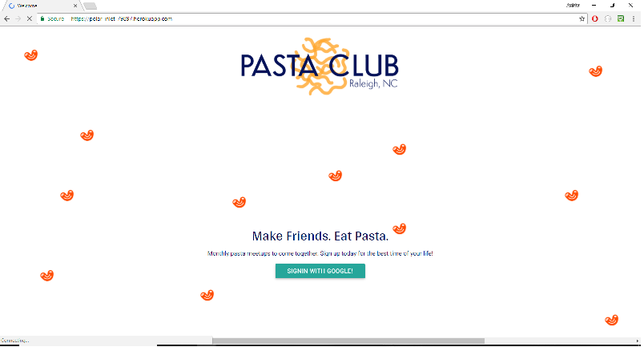
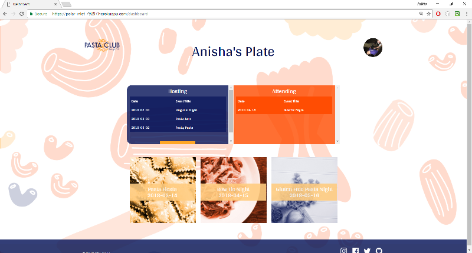

## PastaClub
A social media application for people within a community to meetup at a monthly meetup for a homemade meal.

## Motivation
The motivation for this application was to have a median where a community could get together on a monthly basis in order to meet new people, learn basic cooking skills, and have a sense of belonging. 
 
## Screenshots
To offer you a brief view into our application I have attached screenshots of our welcome and dashboard pages.

Welcome Page:

Dashboard Page:

## Tech/framework used
<ul><b>Built with</b> 
    <li>HTML5</li>
    <li>CSS</li>
    <li>Materialize</li>
    <li>jQuery</li>
    <li>Google OAuth API</li>
    <li>JavaScript</li>
    <li>MySQL Database</li>
    <li>Node/Express</li>
    <li>Sequelize</li>
    <li>GitHub</li>
    <li>Heroku</li>
    <li>Modals</li>
</ul>

## Features
Our application stands out because of many variables we have incorporated within our website. However, we think it really stands out because of features suchs as a polished UI and UX, dynamic updates, Google OAuth enabled User sign-in, and an individualized dashboard page.

## Installation
To get our application running on your personal computer
<ul>
 <li>Git clone the repo</li>
 <li>Create .env file in root
    <ul>
       <li>DB_HOST=localhost</li>
       <li>DB_PORT=3306</li>
       <li>DB_USER=root</li>
       <li>DB_PSWD="your password or null"</li>
       <li>NODE_ENV=development</li>
    </ul>
 </li>
 <li>NPM install should install everything you need from the package.json file we have within our MVC.</li>
 <li>Now move into your repo within your CLI and start the server, once that is done you should be able to see our page on you your          browser using localhost://8080.</li>
</ul>

However, you may also feel free to visit the application deployed through Heroku at <a href="https://polar-inlet-79897.herokuapp.com/dashboard">Pasta Club!</a>

## API Reference

<a href="https://developers.google.com/identity/protocols/OAuth2">Google OAuth 2.0</a>

## Credits
<ul>
<li><a href="https://github.com/abreaw">Brea Torres</a></li>
<li><a href="https://github.com/weirichm">Miriam Bonano</a></li>
<li><a href="https://github.com/snz1210">Saima Zia</a></li>
</ul>

